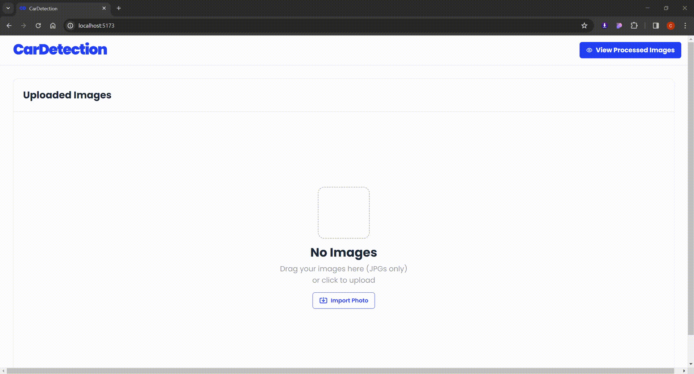

# Screening Test for Project 10 @ CiSTUP Summer Internship 2024

Name: Chinmay Pravin Mhatre <br/>
Email: chinmaymhatre111@gmail.com

## Goal
Develop a web-based application that enables users to upload transportation-related images (such as traffic camera images) and perform object detection on those images.

## Tech Stack
- Frontend: React.js
- Backend: Flask
- Object Detection: OpenCV and YOLOv8
- Deployment: Docker

## Setup
1. Clone the repository
```bash
git clone <repo-url>
```
2. Change the directory
```bash
cd <repo-name>
```
```
3. Run the docker container
```bash
docker-compose up
```
5. Open the browser and go to `http://localhost:5173`

## Run
1. Open the browser and go to `http://localhost:3000`
2. Upload an image. Sample images are provided in the `data` folder.
3. Click on the `View Processed Images` button.
4. The processed image will be displayed with the detected objects.


## Tasks
1. Design and build an attractive user interface (UI) for the web application using HTML, CSS, and JavaScript. The UI should feature a navigation bar, a form for uploading images, and a section to display both the original and processed images.
2. Construct the front-end of the web application using a contemporary JavaScript framework like React or Vue.js. Ensure the application is responsive and offers a smooth user experience.
3. Build a back-end for the web application using a framework such as Flask or Streamlit. The back-end should manage image processing tasks using libraries like OpenCV or scikit-image.
4. Apply object detection to the uploaded images, for instance, recognizing types of vehicles and counting them.
5. Package the web application using Docker for easy deployment. Create a Docker file and a docker-compose.yml file to specify the application's environment and services.
6. Compose a concise README file describing how to set up, run, and test the web application locally. Include any required installation instructions and dependencies.
7. Important! Create/record/screen-capture a short demonstration video highlighting the UI and capabilities of the web application, including the object detection feature. Upload the demo video to the project's GitHub repository.
8. Submit the URL of the GitHub repository containing the code and demo video using this form.